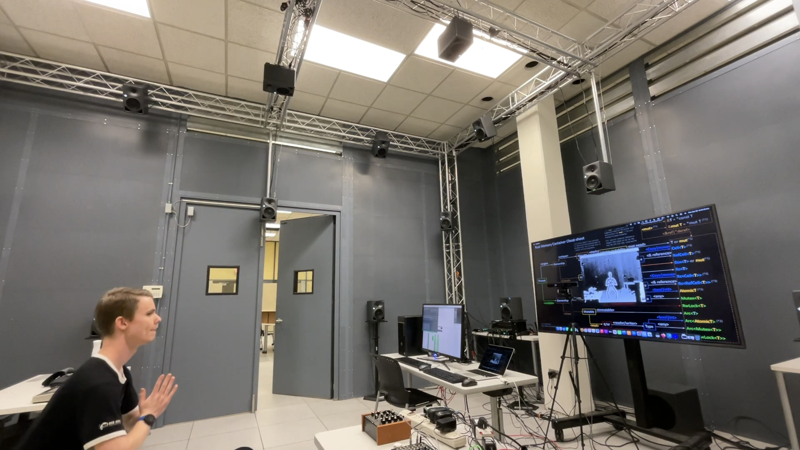

# spatial-auditory-feedback
An exploration of proprioceptive-auditory feedback in the ambisonics domain

# Demo video

# Folders
- The **SpatialAuditoryFeedback-iOS folder** contains an iOS project which uses the LiDAR sensor on an iPad or an iPhone to track user motion and control spatial audio parameters through an app.
- The **SpatialAuditoryFeedback-Processing** folder contains a project through a program called [Processing](https://processing.org/) which has a package called [SimpleOpenNI](https://github.com/totovr/SimpleOpenNI). This package utilizes the original Xbox 360 Kinect (PrimeSense) sensor to track the user and sends skeletal joint data to control spatial audio parameters in SuperCollider.
- The **SpatialAuditoryFeedback-Linux** folder contains a demo project for Linux which is currently able to render to the [speaker setup](https://l42i.music.gatech.edu/projects/3dbox) in the 3DBox at Georgia Tech. In the near future, it will be updated for a binaural/mobile setup for headphone users on the go.
- The **Kinect** folder contains instructions on how to install software for the Kinect.

# Fall 2024 Objective
The goal for fall 2024 is to allow any user to add Kinect devices detected in their USB and parse the data from those devices to perform motion tracking. A C++ library will be written to expose the Kinect controls to a SuperCollider class which will allow the user to do the same thing in the previous example, but without any overhead from Processing. The standalone program (separate from the library but sharing some functionality) will allow the user to add Open Sound Control (OSC) ports which they can then use to send data to any other application of their choosing.
